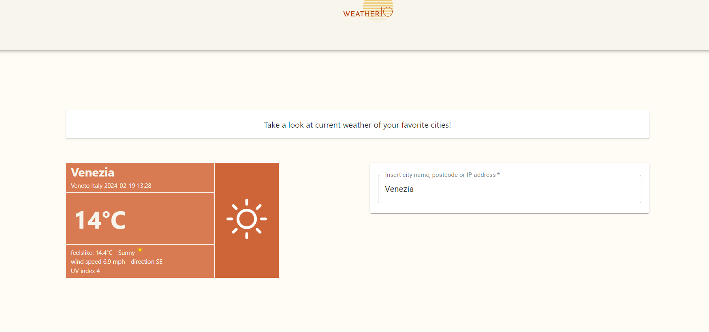

# Weather.io

Weather.io is a web application, developed in React and Typescript, that provides weather forecast and stats.


## Requirements of the app
The application had to show weather stats by using the following three features: 
- **Current weather,** a page where the user can view the current weather data of a selected location;
- **Forecast**, a page that shows forecast for at maximum 7 days of a selected location. 
- **History**, a page that shows forecast of a selected location in the past;

Furthermore, it is possible to save favourite locations and to view their current weather and forecast in a dedicated section. 


## Design

The application has been designed to be user-friendly and easy to maintain and update, so I decided to develop it as a SPA, since its high maintainability and reliability. The software structure is made up of three different components:

- a **Router** component, allows navigation between pages and components belonging to the application and synchronises URL path with the User Interface;
- a **Weather** component, developed by using react-redux library, that makes very easy to manage global states and objects throughout the whole application;
- an **UI** component, developed through user-defined components together with MUI library ones.


### Router

The router makes possible to create different paths within our application and link them with a particular React component.

```typescript
const router = createBrowserRouter([
    {
        path: '/',
        element: (<IntroductionView/>)
    },
    {
        path: '/current',
        element: (<CurrentWeatherView/>)
    },
    {
        path: '/forecast',
        element: (<ForecastView/>)
    },
    {
        path: '/history',
        element: (<HistoryView/>)
    },
])

export const AppRouter = (): ReactElement => {
    return <RouterProvider router={router} />
}
```

The routes are defined through objects having a string as path attribute and a React Element as element attribute.

AppRouter is a React element used as entry point of the application (see [App.tsx](src/App.tsx)) and, through the hook useNavigate(), navigation can be managed in every component where it is needed.


### Weather

Weather hosts the interfaces and the methods designed for the communication between the User Interface and the server. It uses weather data given by  http://weatherapi.com, an open source weather API, and consists of:

- **DTOs** (Data transfer objects), interfaces dedicated to parse the server-side response.

  > Warning: DTOs have to be designed carefully in order to parse the server responses correctly!

- **WeatherService**, the main interface where the API methods calling the server are declared.

- **WeatherServiceImpl**, a concrete class that implements the service methods.

- **Weather slice**, a special collection of methods coming from the redux-library, called thunks and reducers, that can be called on a global scope around the application.


#### Slice

The slice even allows the developer to define different cases depending on the state of the calls.

Moreover, it's set an initial object called `WeatherState` where there are the three groups of interfaces supposed to manage the state of the receiving data sent by the server:

- the responses, described within dto;
- the statuses, that describe the status of the current API calls;
- the filters, that describe the parameters of the GET methods;

```typescript
interface WeatherState {
  currentWeatherResponse?: CurrentWeatherDTO;
  forecastResponse?: ForecastDTO;
  historyResponse?: HistoryDTO;
  currentWeatherStatus: PromiseStatus;
  forecastStatus: PromiseStatus;
  historyStatus: PromiseStatus;
  currentWeatherFilter: CurrentWeatherFilter;
  forecastFilter: ForecastFilter;
  historyFilter: HistoryFilter;
}

...

// example of response DTO
export interface ForecastDTO {
  location: Location;
  current: CurrentData;
  forecast: ForecastData;
}

...

// example of filter interface
export interface ForecastFilter {
  location: string;
  days: number;
}

...

// status type
export type PromiseStatus = "idle" | "loading" | "successfully" | "failed";
```


#### UML sequence diagram of the methods encapsulation

From left to right, a UML sequence diagram that shows how methods are encapsulated, from their definition in the service interface until their closure in slices: 


// diagram


### User Interface

The User Interface has been designed using both user-defined components and MUI library components. These are some examples of pages shown within the application:


#### Introduction


It is pretty visible how the main view of the application is made up of three simple components:

- an header bar
- a drawer menu that shows the different contents
- the content


#### Current Weather



The content is handled through the use of the `Grid` component, that makes much easier to position child components like the shown ones next to each other or one above the other, by setting spacing and columns indexing properly.


Underneath, a piece of code that shows how the current weather reducer gets dispatched:

```typescript
  useEffect(() => {
    dispatch(getCurrentWeatherByLocation(weatherState.currentWeatherFilter));
    if (weatherState.currentWeatherStatus === "successfully") {
      dispatch(resetCurrentWeatherStatus());
    }
  }, [weatherState.currentWeatherFilter]);

  const customizedCurrent = (): ReactElement => {
    if (
      weatherState.currentWeatherStatus === "successfully" &&
      weatherState.currentWeatherResponse !== undefined &&
      weatherState.currentWeatherResponse.current !== undefined &&
      weatherState.currentWeatherResponse.location !== undefined
    ) {
      const data = weatherState.currentWeatherResponse;
      return (
        <CustomCurrentWeather
          currentWeatherData={data}
          maxWidth="420px"
          minWidth="270px"
        />
      );
    }
    return <></>;
  };
```

CustomCurrentWeather component gets updated any time a change of currentWeatherFilter occurs and shows current weather data in real-time of the selected place.


#### Forecast


Forecast component is a bit more complex component made up of the current weather one and of boxes representing the following days of the week.

Such as the previous one, it is possible to set a place and the number of days which you want to see the forecast of.


On click of the box, a forecast dialog of the selected day opens up and shows astronomy data like sunrise and sunset hour, condition and mean temperature per hour and several other data.


#### History


In history page, the date text field compares the string given in input by the user with a regular expression that matches all string with the following format: YYYY-MM-DD.  If the inserted string doesn't match, the call isn't executed.


## Usage

npm is required for the package installation of dependencies and stuff. Once you have installed it, execute the following command

- npm -i (for installing dependencies)
- npm start (for starting the app)

To run the application on http://localhost:3000

> Remember: for the correct execution of API calls to the weather server, .env file in the root directory must be edited with your own API key (instead of your_secret_key). You can create one by signing in in https://weatherapi.com.

Have fun!


## Author

Giovanni Campo
